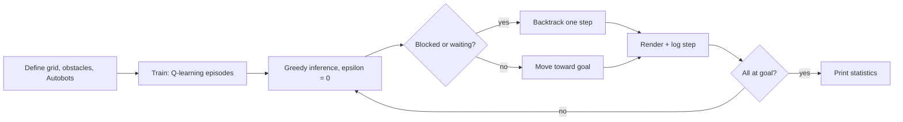

# Warehouse Fleet Q-Learning

> Decentralized Q-learning for fleets of autonomous warehouse vehicles that navigate a grid, avoid obstacles and each other, resolve gridlock by backtracking, and report per-robot statistics, with real-time Pygame visualization.


---

## Problem Statement

A modern warehouse runs many autonomous vehicles (Autobots) in the same floor space. Each one has its own pickup point and destination, and all of them share narrow aisles, shelves (static obstacles), and each other (moving obstacles).

The goal of this project is to design a **Q-learning based controller** so that the fleet:

- reaches every destination,
- never drives into a shelf, a wall, or another Autobot,
- does not freeze in a **deadlock** when aisles are crowded or head-on,
- handles **edge cases**: shared destinations, dead ends, tight corridors, winding routes, loops.

![Demo Video]\([https://github.com/user-attachments/assets/6b5270dd-17e5-4419-bafb-bc8c70a26ae2](https://github.com/user-attachments/assets/6b5270dd-17e5-4419-bafb-bc8c70a26ae2))
---

## Features

| Feature | Description |
|---|---|
| **Multi-agent navigation** | Any number of Autobots, each with its own start, goal and Q-table. |
| **Q-learning (tabular)** | Epsilon-greedy exploration, standard Bellman update. |
| **Static obstacle avoidance** | Shelves and walls are never entered; out-of-bounds moves are rejected. |
| **Dynamic obstacle avoidance** | Every other Autobot is treated as a moving obstacle at decision time. |
| **Collision-safe moves** | A move into an occupied cell is refused and converted to a wait. Head-on swaps are impossible. |
| **Shared destinations** | Several Autobots may finish on the same goal cell without blocking each other. |
| **Wait action** | Autobots can hold position instead of forcing a conflict. |
| **Backtracking** | During inference, a blocked Autobot steps back along its own path to break deadlocks. |
| **Livelock guard** | An Autobot that spends 25 movements without reaching its goal ends the run with a report. |
| **Real-time visualization** | Pygame window (colored bots, outlined goals, obstacles, step counter) plus ASCII grid in the terminal. |
| **Statistics** | Per-bot total time, steps, waiting time, movement breakdown, and fleet average. |
| **Cross-platform** | Run on Windows, Linux, and NVIDIA Jetson Nano 4GB (author-tested). |

---

## Quick Start

```bash
git clone https://github.com/Apurv090405/qfleet-warehouse-autobots.git
cd warehouse-fleet-qlearning
pip install -r requirements.txt
python main.py
```

`requirements.txt`

```txt
pygame==2.0.1
numpy==1.19.5
```

> The pinned versions are the last releases that support Python 3.6, which is what stock Jetson Nano images ship with. On Python 3.9+ on desktop you can install newer `pygame` and `numpy`.

**Headless run** (servers, SSH, CI): the Pygame window can be disabled with a dummy video driver. The ASCII grid and statistics still print.

```bash
# Linux / Jetson
SDL_VIDEODRIVER=dummy python main.py

# Windows (PowerShell)
$env:SDL_VIDEODRIVER="dummy"; python main.py
```

---

## Project Structure

```
.
├── main.py             # Autobot, Simulation, scenarios, training + inference entry point
├── requirements.txt    # Python dependencies
├── README.md           # This file
└── LICENSE             # MIT license
```

---

## How It Works



### State, actions and learning

- **State:** the Autobot's own grid cell `(row, col)`.
- **Actions:** `up`, `down`, `left`, `right`, `wait`.
- **Q-table:** one `rows x cols x 5` NumPy array **per Autobot** (independent learners).
- **Update rule:**

  `Q(s,a) ← Q(s,a) + α · ( r + γ · max Q(s',·) − Q(s,a) )`

- **Action selection:** with probability `ε` pick a random action, otherwise pick the highest-Q action among the **currently valid** ones (inside the grid, not an obstacle, not occupied). If nothing is valid, the Autobot waits.

### Reward function

| Event | Reward |
|---|---|
| Reach own destination | `+100` |
| Step into an obstacle | `-100` |
| Wait / blocked move | `-5` |
| Any normal move | `-1` |

### Default hyperparameters

| Parameter | Value |
|---|---|
| Episodes | `1000` |
| Learning rate `α` | `0.1` |
| Discount `γ` | `0.9` |
| Exploration `ε` (training) | `0.1` |
| Max steps per training episode | `100` |
| Max steps in inference | `100` |
| Movement cap per Autobot in inference | `25` |

### Movement labels in the statistics

`up` is counted as **Forward**, `down` as **Backward**, `left` as **Left**, `right` as **Right**. "Backward" is also incremented when an Autobot backtracks.

### Main classes

**`Autobot`**

- `get_action(epsilon, others)`: epsilon-greedy choice over valid actions.
- `get_valid_actions(others)`: filters out walls, obstacles and occupied cells.
- `move(action, others)`: applies the action, or converts it to a wait if illegal.
- `backtrack()`: steps back to the previous cell to break a deadlock.
- `learn(...)`: Q-table update.
- `reset()`: restores start position and counters between episodes.

**`Simulation`**

- `train(episodes, alpha, gamma, epsilon)`: runs Q-learning episodes and logs total reward every 100 episodes.
- `run_episode(...)`: one training episode for the whole fleet.
- `run_inference()`: greedy run with visualization, backtracking and the movement cap.
- `display_grid(step)`: Pygame rendering.
- `print_grid(step)`: ASCII rendering.
- `print_statistics()`: final report.

---

## Usage Example

```python
grid_size = (5, 5)
obstacles = [(1, 1), (1, 2), (1, 3), (3, 1), (3, 2), (3, 3)]

autobots = [
    Autobot("A", (0, 0), (4, 4), grid_size, obstacles),
    Autobot("B", (4, 0), (0, 4), grid_size, obstacles),
]

simulation = Simulation(grid_size, autobots, obstacles)
simulation.train(episodes=1000, alpha=0.1, gamma=0.9, epsilon=0.1)
simulation.run_inference()
```

Coordinates are `(row, col)` with `(0, 0)` at the top-left. `row` grows downward.

### Terminal output format

```
==================================================
Step <n>:
--------------------------------------------------
A . . . .
. # # # .
. . . . .
B # # # .
. . . . .
--------------------------------------------------
```

Grid legend: `.` free cell, `#` obstacle, letter = Autobot, `E<letter>` = that Autobot's destination.

```
==================================================
Simulation Statistics:
--------------------------------------------------
Autobot A:
  Total Time: <int>
  Total Steps: <int>
  Waiting Time: <int>
  Movements:
    Forward: <int>
    Backward: <int>
    Right: <int>
    Left: <int>
    Wait: <int>
  Total Movements: <int>
--------------------------------------------------
Average Movements per Autobot: <float>
==================================================
```

---

## Edge-Case Scenarios

The repo ships ready-to-use scenarios (commented blocks in `main.py`). Uncomment one, run, and watch.

| # | Scenario | Grid | What it tests |
|---|---|---|---|
| 1 | Two Autobots, same destination | 5x5 | Shared goal cell without blocking |
| 2 / 3 | Gridlock and backtracking | 5x5 | Head-on meeting in a narrow aisle with a bot parked in the middle |
| 5 | Long winding road | 10x5 | Scattered obstacles, crossing paths |
| 6 / 7 | Tight corridor, two bots one path | 5x5 | Single-lane corridor contention |
| 8 | Dead end | 5x5 | Goal partly walled in, bots must retreat |
| 9 | Crowded warehouse (default) | 13x13 | 7 Autobots, 30+ obstacles, mixed crossings |

### Create your own scenario

1. Pick `grid_size = (rows, cols)`.
2. List obstacle cells as `(row, col)` tuples.
3. Create one `Autobot(id, start, end, grid_size, obstacles)` per vehicle. Use unique single-character ids so the ASCII grid stays readable.
4. Build `Simulation(grid_size, autobots, obstacles)`, then `train(...)` and `run_inference()`.

---

## Compatibility

| Platform | Status |
|---|---|
| Windows | Tested by author |
| Linux | Tested by author |
| NVIDIA Jetson Nano 4GB | Tested by author. Runs on CPU, no CUDA needed. |

Tabular Q-learning with small NumPy arrays is light enough for embedded boards. For large grids on the Nano, lower the Pygame `cell_size` or use the headless mode above.

---

## Known Limitations and Roadmap

Being upfront about what the current version does and does not guarantee:

- **Independent learners.** Each Autobot's state is only its own position, so Q-values do not encode goals of others or other bots' positions. Safety comes from action masking (valid-move filtering), not from the Q-table alone.
- **Fixed priority.** Within a step, Autobots resolve moves in list order. Priority by longest remaining path is planned.
- **No hard completion guarantee.** Heavily congested layouts can hit the 25-movement cap; the run then stops and reports the Autobot that failed.
- **Backtracking is local.** It steps back along an Autobot's own history and does not coordinate with others.
- **Static map.** Obstacles do not change during a run.

Planned improvements:

- [ ] Priority scheduling by path length to cut total system time
- [ ] Goal- and neighbor-aware state (multi-agent Q or shared Q-table)
- [ ] Explicit loop and cycle detection
- [ ] Scenario files (JSON/YAML) and a CLI (`--scenario`, `--episodes`, `--headless`)
- [ ] Save / load trained Q-tables
- [ ] Training curves and metrics export (CSV / matplotlib)
- [ ] Unit tests for collision, deadlock and dead-end cases
- [ ] Dynamic obstacles (moving humans, blocked aisles)

---

## Contributing

1. Fork the repo and create a feature branch.
2. Add or change a scenario or feature, with a short description of the edge case it covers.
3. Open a pull request.

Bug reports with the scenario (grid, obstacles, starts, goals) that reproduces the problem are especially welcome.

---

## License

Released under the MIT License. See [LICENSE](LICENSE) for details.
